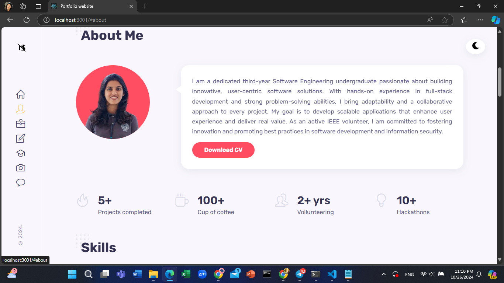
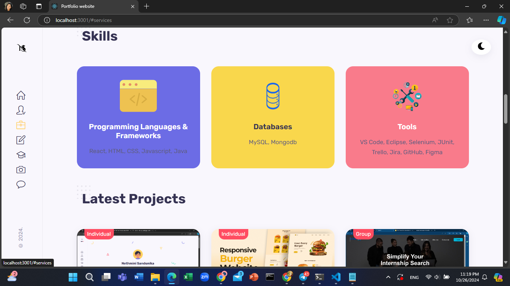
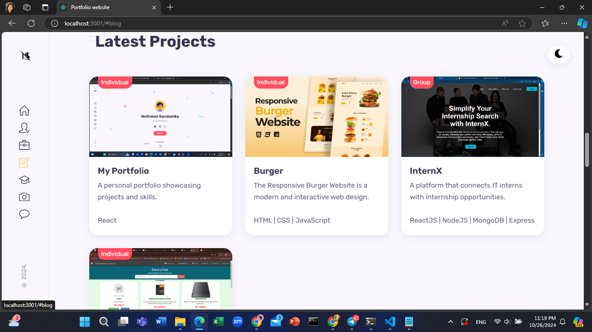
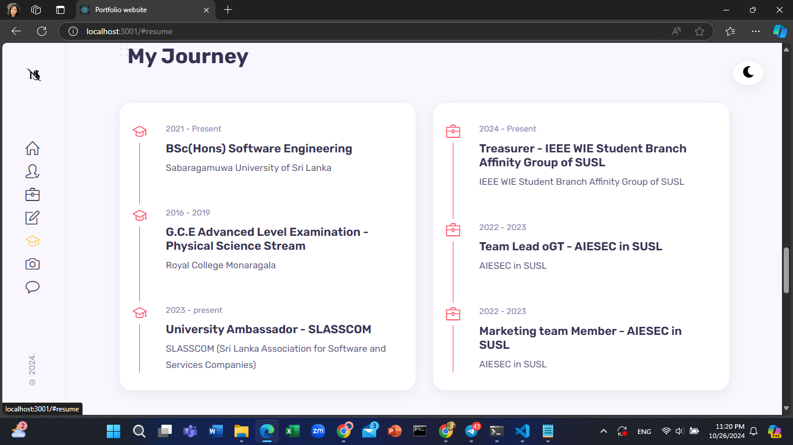
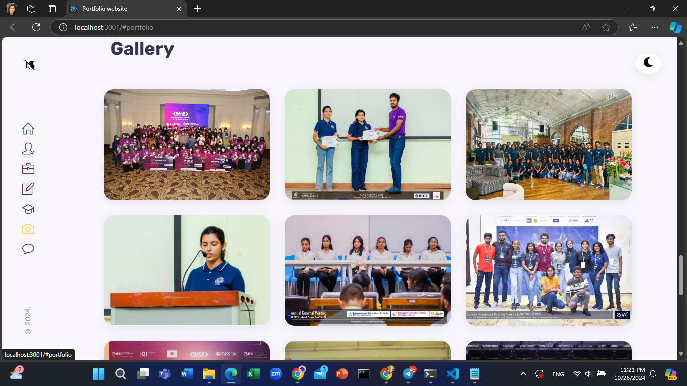
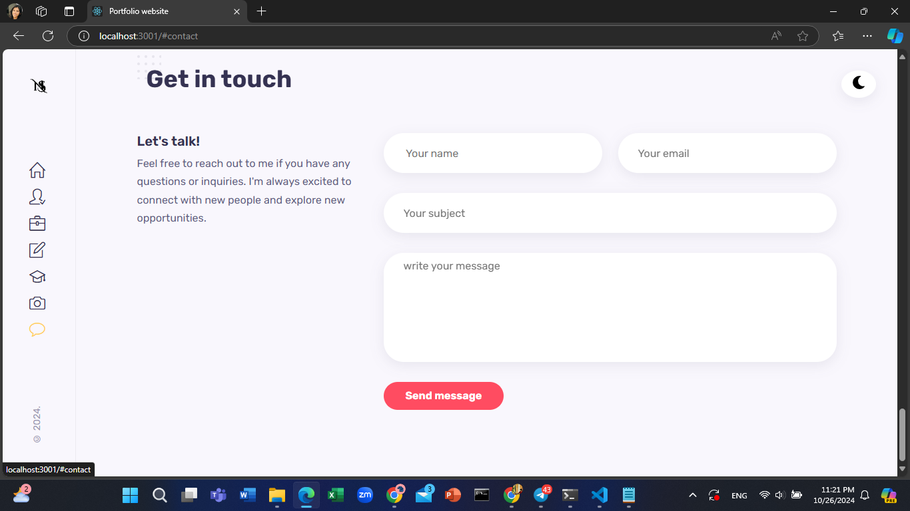

# My Portfolio

Welcome to my portfolio! This React application showcases my skills, projects, and experiences in web development. Here, you'll find a collection of my work along with details about the technologies I use.

## Table of Contents

- [About Me](#about-me)
- [Technologies](#technologies)
- [Projects](#projects)
- [Screenshots](#screenshots)
- [Installation](#installation)
- [Usage](#usage)
- [Contact](#contact)
- [License](#license)

## About Me

I am a passionate web developer with a keen interest in creating dynamic and responsive web applications. My journey in technology has equipped me with a diverse skill set, enabling me to tackle various challenges and contribute effectively to any project.

## Technologies

I am proficient in the following technologies:

- **Frontend:**
  - HTML
  - CSS
  - JavaScript
  - React

- **Tools:**
  - Git
  - GitHub
  - Visual Studio Code

## Screenshots

Here are some screenshots of my projects:

1. **Home**
   

2. **About me**
   

3. **Skills**
   

4. **Projects**
   

5. **My journey**
   

6. **Gallery**
   

7. **Contact me**
   

8. **DarkMode**
   

